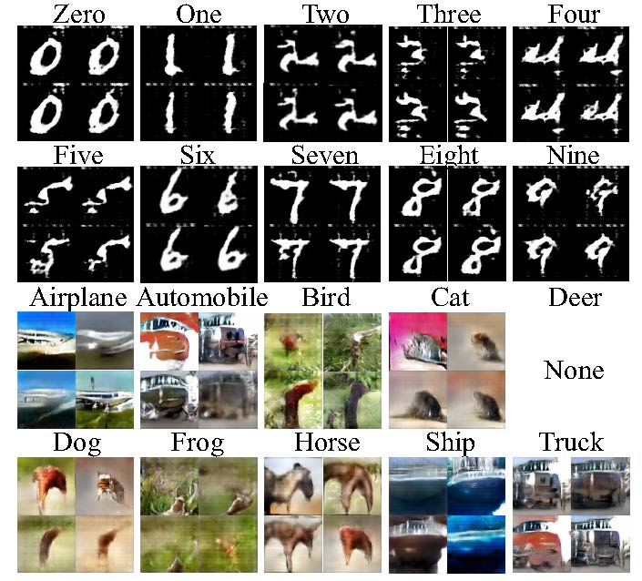

# Listen to the Image

This repository provides a kind of late-blind model, implemented in pytorch.
For more details about this model, please see our paper [Listen to the Image](http://dtaoo.github.io/papers/2019_voice.pdf) by Di Hu, Dong Wang et al, CVPR 2019.

## The Late-Blind Model:


The image and vOICe translator outside the dashed boxes represent the circumstance of blindness with Sensory Substitution devices, while the two-stage model within the boxes consists of preliminary sound embedding and cross-modal generative adversarial perception.

## Cross-modal Perception

Taking the handwritten digits perception as an example. 

### Step one: 

-For obtaining meaningful representation of translated sound, we firstly model the translated sound via a classification task (MNIST dataset), then using the extracted embeddings as the conditional input to cross-modal generation. To start this, just do

```bash
$ python train_vggish.py
```

The trained vggish network are used to embedd the translated sounds into high-dimensional representations, which is used for the following cross-modal generation.

-

### Step two: 

To simulate the piror knowlwdge of the object in late-blind brains, we pre-train the visual classifier (MNIST dataset) and visual generator on another big dataset (EMNIST dataset). To start this, just do

```bash
$ python mnist_classify_train.py
```

```bash
$ python emnist_dcgan.py
```

### Step three: 

A novel cross-modal GAN is utilized to classify the generated visual image to its true category, where the learned audio embeddings are viewed as the input to visual generation, and the whole cross-modal perception model is fine-tuned by identifying the generated images with an off-the-shelf visual classifier. To start this, just do

```bash
$ python train_all.py 
```

The generated images can be found in  `./results`. Note that, the visual model had never seen any real-images, just their translated sounds.


## Imagined visual objects by 'hearing' 
